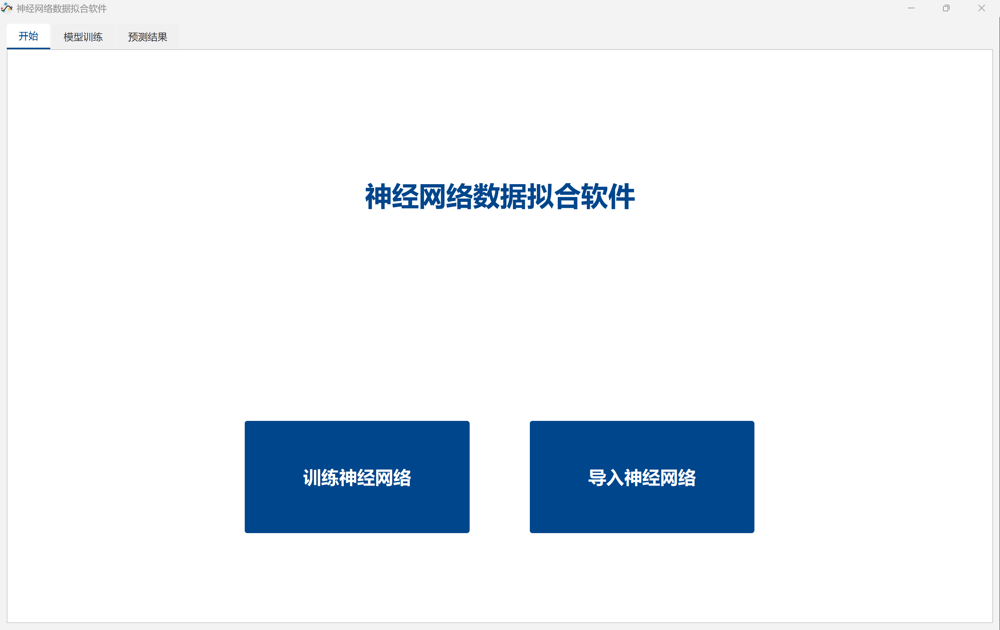
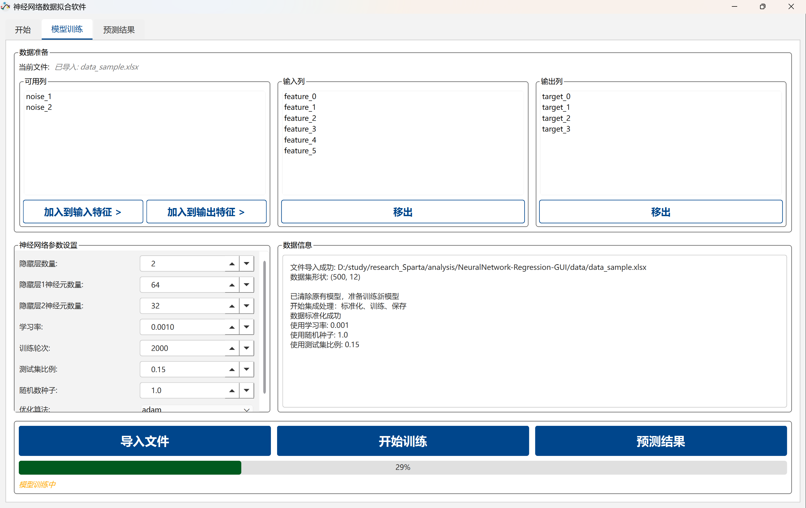
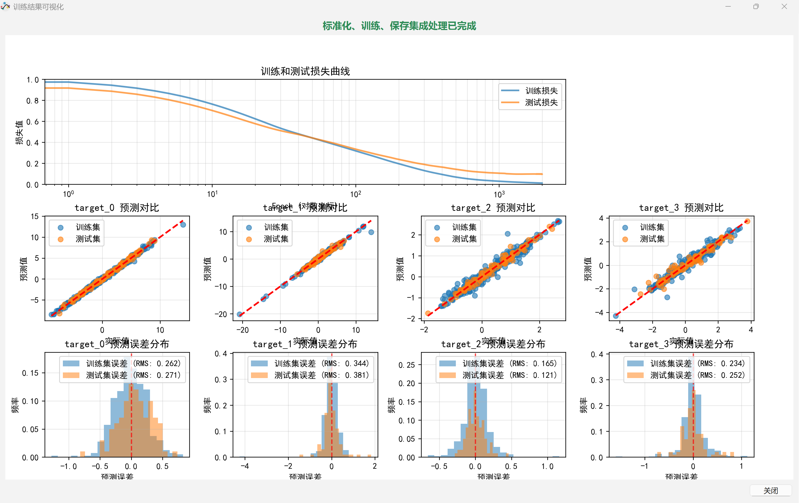
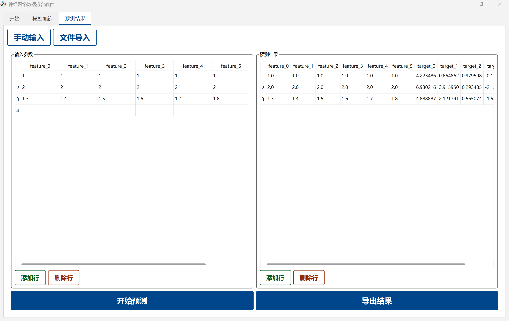
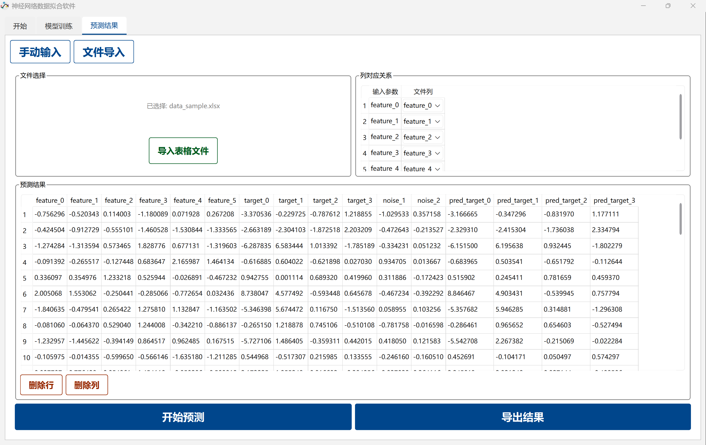

# NeuralNetwork-Regression-GUI

一个基于 PySide6 和 scikit-learn 实现的神经网络回归模型 GUI，支持从本地表格数据进行交互式训练和预测，适用于工程应用场景。

## 功能特点

- 📊 **数据处理**：支持 CSV、XLSX、XLS 格式数据导入，提供输入输出列选择功能
- 🧠 **神经网络训练**：基于 scikit-learn MLPRegressor，支持自定义隐藏层结构和训练参数
- 🎯 **多种预测方式**：支持手动输入预测和文件批量预测
- 📈 **可视化分析**：提供训练过程可视化、预测结果对比和误差分布分析
- 📋 **Excel 风格表格**：实现了类似 Excel 的表格组件，支持数据编辑、管理和删除操作
- 💾 **模型持久化**：支持模型保存和加载，便于重复使用
- 🎨 **现代化界面**：基于 PySide6 构建的直观、美观的图形界面

## 技术栈

- **GUI 框架**：PySide6
- **机器学习库**：scikit-learn
- **数据处理**：pandas, numpy
- **可视化库**：matplotlib
- **文件处理**：openpyxl, xlrd
- **图像处理**：pillow

## 项目结构

```
NeuralNetwork-Regression-GUI/
├── resources/               # 资源文件目录
│   └── NeuralNetwork.ico    # 应用图标
├── scripts/                 # 辅助脚本
│   ├── data_sample_generate.py  # 数据样本生成脚本
│   └── icon_generate.py     # 图标生成脚本
├── src/                     # 主源码目录
│   ├── data_processor.py    # 数据加载和处理
│   ├── excel_like_table.py  # Excel风格表格组件
│   ├── main_window.py       # 主窗口和核心逻辑
│   ├── model_manager_sklearn.py  # scikit-learn模型管理
│   ├── prediction_tab.py    # 预测功能标签页
│   ├── start_tab.py         # 起始界面
│   ├── styles.py            # 样式管理
│   ├── training_tab.py      # 模型训练标签页
│   └── visualization_window.py  # 可视化窗口
├── .gitignore               # Git忽略文件
├── LICENSE                  # 许可证
├── README.md                # 项目说明
├── requirements.txt         # 依赖列表
└── run.py                   # 应用入口
```

## 安装和运行

### 1. 创建虚拟环境

```bash
# Windows
python -m venv venv
venv\Scripts\activate

# Linux/Mac
python3 -m venv venv
source venv/bin/activate
```

### 2. 安装依赖

```bash
pip install -r requirements.txt
```

### 3. 运行应用

#### 方式一：直接运行Python脚本

```bash
python run.py
```

#### 方式二：打包为可执行文件

如果您想将应用打包为可执行文件（无需Python环境即可运行），可以使用pyinstaller：

1. **安装pyinstaller**：
   ```bash
   pip install pyinstaller
   ```

2. **执行打包命令**：
   ```bash
   pyinstaller -F -w -i "resources/NeuralNetwork.ico" --add-data "resources/NeuralNetwork.ico:." --name="NeuralNetwork.exe" "run.py"
   ```

3. **获取可执行文件**：
   - 打包完成后，可执行文件将生成在`dist/`目录中
   - 可执行文件包含了所有依赖，无需额外安装
   - 首次运行可能会较慢，请耐心等待
   - 应用数据和模型会保存在与可执行文件相同的目录中

## 使用指南

### 训练流程

1. **启动应用**：运行 `run.py` 启动应用程序
2. **进入训练界面**：点击 "模型训练" 标签页
3. **导入数据**：点击 "导入数据" 按钮，选择本地 CSV/XLSX/XLS 文件
4. **选择列**：在左侧列表中选择输入列和输出列
5. **配置网络参数**：
   - 设置隐藏层数量和每层神经元数量
   - 调整学习率、训练轮次、随机种子等参数
   - 选择优化算法和激活函数
6. **执行训练**：点击 "开始训练" 按钮
7. **查看结果**：训练完成后，会自动显示训练可视化结果
8. **保存模型**：训练完成后，模型会自动保存到项目目录

### 预测流程

#### 方式一：手动输入预测

1. **进入预测界面**：点击 "预测结果" 标签页
2. **选择预测方式**：在 "预测结果" 标签页中选择 "手动输入"
3. **输入数据**：在表格中输入要预测的数据
4. **执行预测**：点击 "开始预测" 按钮
5. **查看结果**：预测结果会显示在表格中
6. **导出结果**：点击 "导出结果" 按钮，选择导出格式（Excel/CSV）

#### 基于文件输入的预测

1. **进入预测界面**：点击 "预测结果" 标签页
2. **选择预测方式**：在 "预测结果" 标签页中选择 "导入表格"
3. **导入数据**：点击 "导入表格" 按钮，选择要预测的数据文件
4. **执行预测**：点击 "开始预测" 按钮
5. **查看结果**：预测结果会显示在表格中（最多显示50行，完整数据可导出）
6. **数据修改**（可选）：
   - **删除行**：选中要删除的行，点击 "删除行" 按钮或右键菜单选择 "删除行"
   - **删除列**：选中要删除的列，点击 "删除列" 按钮或右键菜单选择 "删除列"
   - 删除操作会实时更新底层数据，删除后不可恢复
7. **导出结果**：点击 "导出结果" 按钮，选择导出格式（Excel/CSV），导出的数据将包含所有修改

## 界面展示

### 起始界面

起始界面提供了应用介绍和快速导航功能，用户可以选择进入模型训练或预测界面。



### 模型训练界面

模型训练界面包含数据导入、列选择、网络参数配置和训练控制功能。



### 训练可视化界面

训练可视化界面展示训练过程的损失曲线、预测值与真实值对比图以及误差分布图。



### 预测结果界面

#### 基于手动输入的预测



#### 基于文件输入的预测



## 核心组件说明

### 数据处理器 (DataProcessor)

负责数据的加载、预处理和管理，支持多种文件格式，提供数据标准化功能。

### 模型管理器 (ModelManagerSklearn)

基于 scikit-learn MLPRegressor 实现神经网络模型管理，支持模型训练、预测、保存和加载。

### Excel 风格表格 (ExcelLikeTable)

实现了类似 Excel 的表格组件，支持数据编辑、复制粘贴和格式化，提升用户体验。

## 辅助脚本

- **data_sample_generate.py**：用于生成数据样本，方便测试和演示
- **icon_generate.py**：用于生成应用图标

## 许可证

本项目采用 MIT 许可证，详情请查看 [LICENSE](LICENSE) 文件。

## 作者

本项目由用户自行开发，基于 PySide6 和 scikit-learn 构建。

## 反馈与改进

欢迎提交 Issue 或 Pull Request 来改进本项目。

## 致谢

感谢 PySide6、scikit-learn、pandas 等开源库的开发者们。
